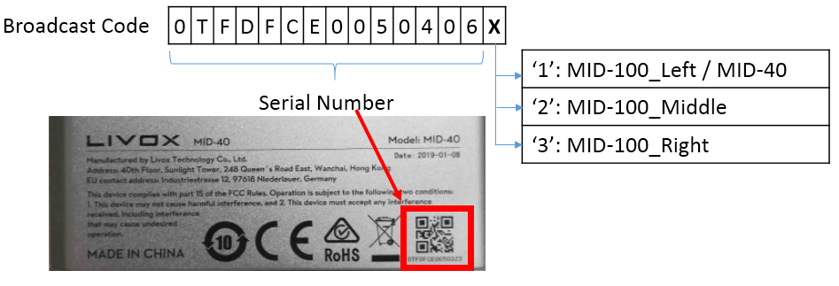

# Livox ROS Demo

Livox ROS demo is an application software running under ROS environment. It supports point cloud display using rviz. The Livox ROS demo includes two software packages, which are applicable when the host is connected to LiDAR sensors directly or when a Livox Hub is in use, respectively. This Livox ROS demo supports Ubuntu 14.04 (ROS Indigo)/Ubuntu 16.04 (ROS Kinetic), both x86 and ARM. It has been tested on Intel i7 and Nvidia TX2. 

## Livox ROS Demo User Guide

The Livox-SDK-ROS directory is organized in the form of ROS workspace, and is fully compatible with ROS workspace. A subfolder named ***src*** can be found under the Livox-SDK-ROS directory. Inside the ***src*** directory, there are two ROS software packages: display_lidar_points and display_hub_points.

### Compile & Install Livox SDK 

1. Download or clone the [Livox-SDK/Livox-SDK](https://github.com/Livox-SDK/Livox-SDK/) repository on GitHub. 

2. Compile and install the Livox SDK under the ***build*** directory following `README.md` of Livox-SDK/Livox-SDK

### Run ROS Demo and Display PointCloud by rviz 

1. Download or clone the code from the Livox-SDK/Livox-SDK-ROS repository on GitHub. 

2. Compile the ROS code package under the Livox-SDK-ROS directory by typing the following command in terminal:
    ```
    catkin_make
    ```

3. Source setup.bash file:
    ```
    source ./devel/setup.bash
    ```

4. Launch the compiled ROS node with launch args of broadcast code.

    ```
    roslaunch display_lidar_points livox_lidar.launch bd_list:="broadcast_code1&broadcast_code2&broadcast_code3"
    ```
     or
     ```
     rosrun display_hub_points livox_hub.launch bd_list:="hub_broadcast_code"
     ```

**NOTE**:Please replace the `"broadcast_code1&broadcast_code2&broadcast_code3"`with your LiDAR's broadcast code.The broadcast code consists of its serial number and an additional number (1,2, or 3). The serial number can be found on the body of the LiDAR unit (below the QR code). The detailed format is shown as below:

